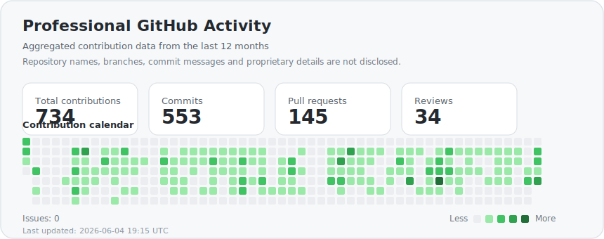

## 💼 Professional Activity

I actively contribute to public repositories and organization-owned repositories as part of my professional work.

> Private and organization-owned repository activity is represented only in aggregated form. Repository names, commit details, branches, issues, and proprietary information are not disclosed.

  

